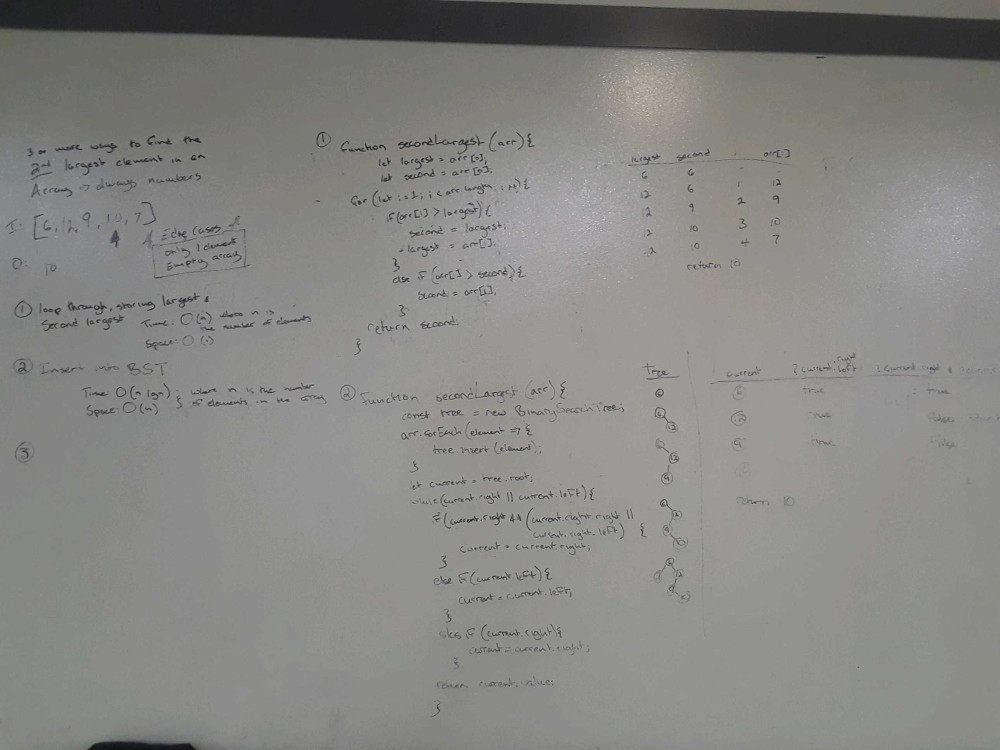
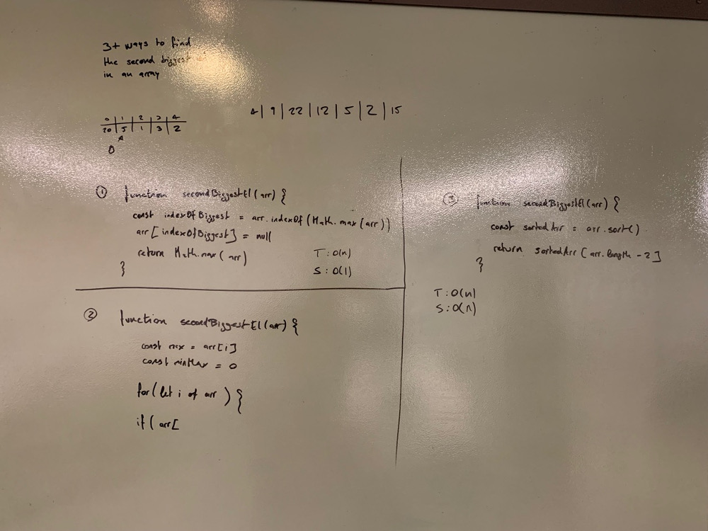

## Authors: Morgana and Joé
# Challenge Summary  
  
Second Biggest Element  
  
## Challenge Description  
  
Find 3+ ways to return the second biggest element in an array  
  
## Approach & Efficiency  
  
### findSecondBiggestByRemovingMax  
Get the index of the max value, change it to 'null' and return the max value of the modified array  
  
### findSecondBiggestWithBST  
Create a binary search tree from the array and traverse either right or left (based on a series of conditionals) to find the second largest value  
  
### findSecondBiggest **Most optimal solution**  
Loop through the array and store the largest and second largest and return the second largest  
  
| findSecondBiggestByRemovingMax | findSecondBiggestWithBST         | findSecondBiggest   |  
| :----------------------------- | :------------------------------- | ------------------- |  
| T: O(2n)                       | T: O(n logN)                     | T: O(n)             |  
| S: O(1)                        | S: O(n)                          | S: O(1)             |  
  
  
  
